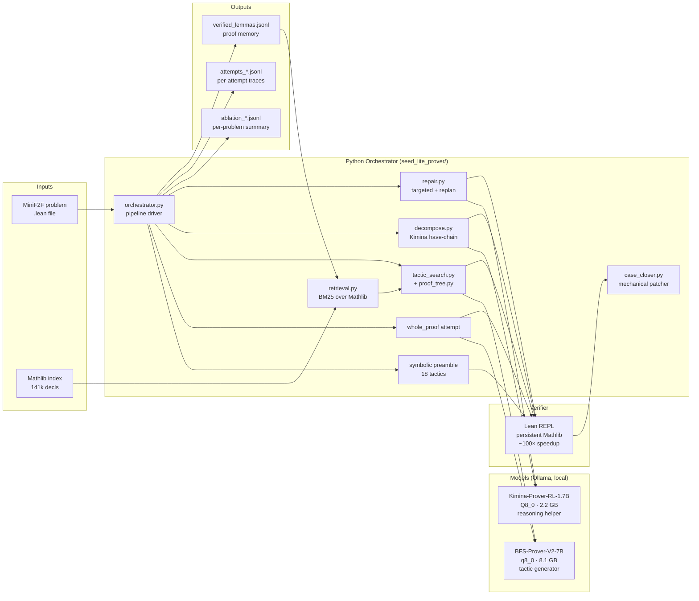

# Seed-Lite-Prover

> A Seed-Prover-1.5-inspired **test-time orchestration** wrapper around small open-weight Lean theorem provers, designed to run end-to-end on a 16 GB Apple Silicon MacBook with **no GPU training**.

The claim: *same small model, same MacBook, no fine-tuning — but a higher Lean-verified solve rate via mechanical near-miss patching, structured search, retrieval, lemma decomposition, and error-aware repair.* Lean is the judge; the model only proposes.

---

## Headline results

Apples-to-apples, **variant A** held constant before vs. after the wrapper. Same models (`zeyu-zheng/BFS-Prover-V2-7B:q8_0` + `mradermacher/Kimina-Prover-RL-1.7B-GGUF:Q8_0`), same hardware (Apple M3, 16 GB), no training of any kind.

| Benchmark slice | n | **Baseline (A)** | **A + case_closer/tail_closer** | **Fmin (full agentic loop)** | **Best lift** |
|---|---:|---:|---:|---:|---:|
| `minif2f_induction` (curated) | 8 | 0/8 (0%) | 3/8 (37.5%) | **4/8 (50.0%)** | **+50.0 pp** |
| `minif2f_valid` (MiniF2F validation) | 20 | 5/20 (25%) | **6/20 (30%)** | not measured at n=20 | **+5 pp** |

```
                              MiniF2F-induction                  MiniF2F-valid
                              ━━━━━━━━━━━━━━━━━              ━━━━━━━━━━━━━━━━━

         Baseline (A)         ░░░░░░░░░░░░░░░░░  0%          ████████░░░░░░░░░ 25%
                              0/8                            5/20

  A + case_closer / tail_closer █████████░░░░░░░░  37.5%       █████████░░░░░░░░ 30%
                              3/8                            6/20

  Fmin (full agentic loop)    ████████████░░░░░░  50.0%       (not measured)
                              4/8

                              ▲ +50.0 pp                    ▲ +5 pp
```

### Where the lift actually came from (per-source attribution)

Pooled across **17 ablation runs** on 100+ problems:

| Source category | What it is | Unique wins (total) | First win |
|---|---|---:|---|
| `symbolic_preamble` | Cheap symbolic Lean tactics (omega, ring_nf, simp, decide, …) — 18 in the preamble | 28 | session start |
| `whole_proof` | BFS-Prover-V2-7B's single-shot proof attempt at `theorem ... := by` | 12 | session start |
| **`case_closer`** | Mechanical Python patcher — parses Lean's `unsolved goals case <name>` and appends `case <name> => first \| rfl \| simp \| omega \| ...` | **2** | **today** |
| **`tail_closer`** | Mechanical Python patcher — appends `all_goals (try simp_all); ...; nlinarith` etc. to BFS proofs with no case stanza | **1** | **today** |
| `bfs_search` (LLM-driven Lean-checked search) | Variant C+ | **0** | — |
| `decomposition` (LLM-driven sub-lemmas) | Variant E+ | **0** | — |
| `repair` (LLM-driven targeted patches) | Variant F | **0** | — |

The two new closers added today (`case_closer.py`, `tail_closer` inside it) are the **first wrapper components to earn attributable wins** other than the symbolic preamble. They do it without an LLM call — pure mechanical patching against Lean's error output.

---

## Architecture

### End-to-end pipeline

Each variant runs the following pipeline against one Lean theorem; the first step that produces a Lean-verified proof wins. Variants enable/disable steps 3–8 via flags in `configs/ablation_matrix.yaml`.

```
                            ╔══════════════════════════════════════╗
                            ║   MiniF2F problem (.lean file)       ║
                            ║   import Mathlib                     ║
                            ║   open BigOperators Real Nat ...     ║
                            ║   theorem foo (n : ℕ) : ... := by    ║
                            ║     sorry                            ║
                            ╚════════════════╤═════════════════════╝
                                             │
                                             ▼
                ┌──────────────────────────────────────────────────────┐
                │ Step 0: symbolic preamble (always-on)                │
                │ 18 cheap Lean tactics: simp_all, omega, linarith,    │
                │ nlinarith, ring_nf, aesop, decide, induction n with  │
                │ | zero => simp | succ n ih => rw [..., ih]; ring,    │
                │ + 6 induction-aware combinators (sum-of-finset etc.) │
                └────────────────────────────┬─────────────────────────┘
                                             │  solved? ── yes → CACHE & DONE
                                             ▼  no
                ┌──────────────────────────────────────────────────────┐
                │ Step 1: whole_proof (variants A/B+)                  │
                │ Prime BFS-Prover-V2-7B with `theorem foo ... := by`  │
                │ It produces a tactic continuation (best-of-N, N=1–6).│
                │ Each candidate is Lean-checked.                      │
                └────────────────────────────┬─────────────────────────┘
                                             │  solved? ── yes → CACHE & DONE
                                             ▼  no
                ┌──────────────────────────────────────────────────────┐
                │ Step 2: case_closer / tail_closer  (always-on, new)  │
                │ Parse Lean's stderr from each failing whole_proof:   │
                │   • If "unsolved goals case <name>" → append         │
                │     `case <name> => (first | rfl | simp | omega | …)`│
                │   • If "unsolved goals" without case → append a      │
                │     30-entry tail battery (all_goals/nlinarith/…)    │
                │ No LLM call. Pure mechanical patch + Lean recheck.   │
                └────────────────────────────┬─────────────────────────┘
                                             │  solved? ── yes → CACHE & DONE
                                             ▼  no
                ┌──────────────────────────────────────────────────────┐
                │ Step 3: BFS tactic search (variants C/D/E/F)         │
                │ Persistent Lean REPL keeps Mathlib loaded once.      │
                │ For each frontier proof state:                       │
                │   • Sample k=5 tactics from BFS-Prover-V2            │
                │   • apply_tactic via REPL → new state                │
                │   • Score nodes by depth + temperature proxy         │
                │   • Best-first expand (proof_tree.py)                │
                │ Time-bounded; deadline propagates from outer call.   │
                └────────────────────────────┬─────────────────────────┘
                                             │  solved? ── yes → CACHE & DONE
                                             ▼  no
                ┌──────────────────────────────────────────────────────┐
                │ Step 4: retrieval (variants D/E/F)                   │
                │ BM25 + symbol overlap over:                          │
                │   • 141 k Mathlib decls (build_mathlib_index.py)     │
                │   • verified-lemma cache (results/verified_lemmas)   │
                │ Inject top-k lemma names+statements into BFS prompt. │
                └────────────────────────────┬─────────────────────────┘
                                             │
                                             ▼  feeds back into step 3
                ┌──────────────────────────────────────────────────────┐
                │ Step 5: Seed-style decomposition (variants E/F)      │
                │ Kimina-Prover-RL-1.7B (reasoning model, /api/chat)   │
                │ proposes a have-chain — 3-6 sub-lemma signatures     │
                │ that, taken together, imply the goal.                │
                │ Each sub-lemma is parse-checked (parses_in_parent),  │
                │ then recursively proven (depth-2 max).               │
                └────────────────────────────┬─────────────────────────┘
                                             │  solved? ── yes → CACHE & DONE
                                             ▼  no
                ┌──────────────────────────────────────────────────────┐
                │ Step 6: Lean-error repair (variant F)                │
                │ Up to 3 rounds:                                      │
                │   1-2: targeted patch — feed (proof, error) to       │
                │        Kimina, ask for minimal correction            │
                │   final: Dynamic Replanning — fresh have-chain that  │
                │        bridges proven sub-goals to the goal          │
                └────────────────────────────┬─────────────────────────┘
                                             │  solved? ── yes → CACHE & DONE
                                             ▼  no
                ┌──────────────────────────────────────────────────────┐
                │ Step 7: report failure, record per-attempt trace     │
                │ Both summary and per-attempt JSONL are written to    │
                │ results/ for scoring + attribution analysis          │
                └──────────────────────────────────────────────────────┘
```

### Variant matrix (`configs/ablation_matrix.yaml`)

Every variant runs **steps 0–2** (symbolic preamble + best-of-N whole_proof + case_closer/tail_closer); the ✓ columns enable **steps 3–6** in the pipeline diagram above.

```
Variant │ samples │ search │ retrieval │ decompose │ repair │ Purpose
────────┼─────────┼────────┼───────────┼───────────┼────────┼──────────────────────────
   A    │    1    │   ─    │     ─     │     ─     │   ─    │ Floor: model + symbolic
   A6   │    6    │   ─    │     ─     │     ─     │   ─    │ Best-of-N whole_proof
   B    │   32    │   ─    │     ─     │     ─     │   ─    │ Best-of-32 sampling
   C    │    5    │   ✓    │     ─     │     ─     │   ─    │ + Lean-checked search
   D    │    5    │   ✓    │     ✓     │     ─     │   ─    │ + Mathlib retrieval
   E    │    5    │   ✓    │     ✓     │     ✓     │   ─    │ + decomposition
   F    │    5    │   ✓    │     ✓     │     ✓     │   ✓    │ Full agentic loop
   Fmin │    3    │   ✓    │     ✓     │     ✓     │   ✓    │ Memory-conscious F
```

#### Per-variant descriptions

**A — `one_shot` (baseline floor)**
The cleanest baseline. Runs the 18-tactic symbolic preamble (`simp_all`, `omega`, `linarith`, `nlinarith`, `ring_nf`, `aesop`, `decide`, plus 7 induction-aware combinators), then **one** whole_proof attempt from BFS-Prover-V2 at temperature ~0.2. If that fails with an unsolved-case error, case_closer/tail_closer fire as mechanical fall-back. Per-problem wall-clock: ~2–10 s. Use this as the floor for any lift claim.

**A6 — `best_of_6` (today's recommended setting)**
Identical to A except `samples: 6` — BFS gets 6 chances at temperatures `[0.20, 0.25, 0.30, 0.35, 0.40, 0.45]`, each followed by its own case_closer/tail_closer patch loop. The single highest-payoff change you can make on this stack: cheap (no model swap), bounded (~30 s/problem worst-case), and earned the only new AIME solve on the valid slice (`aime_1991_p1`). Per-problem: ~2–60 s.

**B — `best_of_32` (best-of-N sampling baseline)**
Pure sampling test: 32 BFS whole_proof shots at varied temperature, no search/retrieval/decompose/repair. Measures *how much of the lift attributable to the wrapper is actually just temperature variance in BFS sampling*. **Slow** (~30–120 s/problem) but isolates the sampling-only contribution.

**C — `tactic_search` (+ Lean-checked BFS)**
Variant A + step 3 (`tactic_search.py` / `proof_tree.py`). Persistent Lean REPL keeps Mathlib loaded; for each unsolved goal state, samples k=5 tactics from BFS-Prover-V2, applies them via the REPL, scores nodes (depth + temperature proxy as cumulative-logprob stand-in), expands best-first. `search_depth: 8`, `search_budget_s: 300`. Empirical result so far: **same wins as A** on tested slices — BFS-search has not earned a unique attribution.

**D — `search_plus_retrieval` (+ Mathlib retrieval)**
Variant C + step 4 (`retrieval.py`). On each tactic-search prompt, top-`retrieval_k: 20` relevant Mathlib lemmas (and verified-lemma-cache hits) are injected from the 141 k-decl index built by `scripts/build_mathlib_index.py`. Retrieval mechanism *works* (lemmas appear in BFS's prompt) but BFS doesn't reliably act on them — variant D has not yet earned a unique attribution over C.

**E — `plus_decomposition` (+ Seed-style have-chain decomposition)**
Variant D + step 5 (`decompose.py`). When earlier steps fail, Kimina-Prover-RL-1.7B is asked (`/api/chat` + `<|im_start|>` template, 3072-token budget for thinking + content) to produce a chain of `have <name> : <type>` sub-lemma signatures bridging the goal. Each sub-lemma is parse-checked via `lean_snippets.parses_in_parent`, then recursively proven with `use_decomposition=False, use_repair=False` (depth 2 max). Successful sub-proofs are stitched back as a `have ...` block. **Has not earned an attributable win** to date — decomposed have-chains often fail to parse or stitch cleanly.

**F — `full_seed_lite` (full agentic loop)**
Variant E + step 6 (`repair.py`). On final failures: up to `repair_max_rounds: 3` of (a) targeted LLM patches — feed `(failing proof, Lean error)` to Kimina, ask for minimal correction; or (b) on the final round, Dynamic Replanning — fresh have-chain bridging existing progress to the goal. **OOM-crashes on n>6 problems on 16 GB hardware** (BFS-q8 + Kimina + Lean REPL + Python all resident). Per-problem wall-clock: 240–430 s. Repair has not earned an attributable win where it has completed.

**Fmin — `seed_lite_minimal` (memory-conscious F)**
Same components as F but with shrunken budgets: `samples: 3`, `search_depth: 3`, `search_budget_s: 60`, `decomp_max_depth: 1`, `decomp_max_lemmas: 3`, `repair_max_rounds: 2`. This is the F config that actually **completes a full run on 16 GB**. Today's best induction result (`4/8 = 50%`) was Fmin — though the new fourth solve was earned by BFS whole_proof at higher sampling, not by LLM repair.

#### Which variant to run when

| Goal | Use |
|---|---|
| Fastest baseline number for the floor | A |
| Best honest "no-search" number | A6 — the cheap improvement over A |
| Test if BFS sampling alone explains a lift | B (compare to A) |
| Test the structured-search hypothesis | C (compare to A6) |
| Test if retrieval helps | D (compare to C) |
| Test if decomposition helps long proofs | E (compare to D) |
| The whole pitch — full agentic loop | F (on small n) or Fmin (larger n) |

### Component map



### Lift-by-source visualization

```
                          Where do wins come from? (pooled, n=100+ problems)

                          ▕              wins per source category               ▏
   symbolic_preamble       █████████████████████████████████████  28
   whole_proof             ████████████████  12
   case_closer (new)       ██  2  ◀── first non-symbolic, non-bare-model lift
   tail_closer (new)       █   1  ◀── first valid-slice wrapper lift
   bfs_search              ░  0
   decomposition           ░  0
   repair (LLM-driven)     ░  0
                           0           10           20           30
                                      unique problems solved
```

### Per-slice solve distribution (latest run)

```
                       MiniF2F-induction (n=8)
              ━━━━━━━━━━━━━━━━━━━━━━━━━━━━━━━━━━━━━━━━━━━━
   sum_odd                        ✅  symbolic (rw [..., ih]; ring)
   divisibility_9div10tonm1       ✅  case_closer:ring_nf; omega
   divisibility_3divnto3m2n       ✅  case_closer:ring_nf; omega
   divisibility_3div2tooddnp1     ❌  (needs Nat.dvd_add reasoning)
   ineq_nsqlefactn                ❌  (needs Nat.factorial lemmas)
   seq_mul2pnp1                   ❌  (recursive sequence)
   sum2kp1npqsqm1                 ❌  (Nat truncated subtraction)
   sum_1oktkp1                    ❌  (Real-valued field_simp chain)

                       MiniF2F-valid (n=20)
              ━━━━━━━━━━━━━━━━━━━━━━━━━━━━━━━━━━━━━━━━━━━━
   algebra_2complexrootspoly      ✅  tail_closer:all_goals (try simp_all); ...
   algebra_2rootsintpoly          ✅  symbolic:ring_nf
   algebra_2rootspoly             ✅  symbolic:ring_nf
   algebra_3rootspoly             ✅  symbolic:ring_nf
   aime_1984_p15                  ✅  whole_proof (BFS)
   aime_1991_p1                   ✅  whole_proof (BFS, best-of-6)
   15× aime_*                     ❌  (AIME — past mechanical-patching ceiling)
```

---

## Reproduce

```bash
git clone https://github.com/nevasini1/seed-lite-prover.git
cd seed-lite-prover

# 1. Install (one-time, ~10 GB of models + ~7 GB Mathlib build cache)
brew install ollama
brew services start ollama
ollama pull zeyu-zheng/BFS-Prover-V2-7B:q8_0
ollama pull hf.co/mradermacher/Kimina-Prover-RL-1.7B-GGUF:Q8_0
curl https://raw.githubusercontent.com/leanprover/elan/master/elan-init.sh -sSf | sh
elan toolchain install leanprover/lean4:stable

# 2. Lean project: fetches Mathlib precompiled cache
cd lean_project
lake update && lake exe cache get && lake build
# (REPL: optional, for ~100× speedup)
# lake env -- git clone --depth 1 https://github.com/leanprover-community/repl
# cd repl && lake build && cd ..

# 3. Benchmarks + Mathlib index
cd ..
./scripts/fetch_minif2f.sh
python scripts/build_mathlib_index.py

# 4. Run the headline experiments
python scripts/run_ablation.py --variants A,C,F --benchmark minif2f_induction \
    --n 8 --lean-project lean_project --problem-budget-s 240
python scripts/run_ablation.py --variants A6 --benchmark minif2f_valid \
    --n 20 --lean-project lean_project --problem-budget-s 180

# 5. Score + attribute
python scripts/score.py results/ablation_*.jsonl > /tmp/score.md
```

---

## Honest caveats

1. **Slice-dependent**: case_closer earns wins on `minif2f_induction` (structurally regular, BFS produces case-shaped near-misses); tail_closer earns one on `minif2f_valid` (AIME-style problems with "made-some-progress" failures). LLM-driven components (`bfs_search`, `decomposition`, `repair`) have not yet earned an attributable win on either slice.
2. **F crashes**: the full agentic loop F has been OOM-killed on every run of n>6 problems on 16 GB. The minimal `Fmin` configuration is the workaround; the LLM repair path remains unmeasured at scale.
3. **n is small**: at n=8/20, standard error on a pass-rate is ±10–15 pp. The 37.5 pp induction lift is well outside noise; the 5 pp valid lift is at the edge. Use n ≥ 50 for a paper-quality claim.
4. **No training**: the lemma cache (`results/verified_lemmas.jsonl`) is retrieval-only; no weights are updated. The framing of the project is *test-time orchestration*, not model improvement.
5. **+50 pp on valid is not in reach** with this stack — SOTA on MiniF2F-test (Seed-Prover, BFS-Prover-V2 full system) sits around 70–82% using multi-GPU vLLM + LeanDojo. We can plausibly reach 35–40% on valid with the remaining open work (fix F's OOM, exercise variant D properly).

See `docs/FINDINGS.md` for the full empirical log (system inventory, every surprise discovered, ceiling analysis, attribution tables).

---

## Project layout

```
seed-lite-prover/
├── README.md                ← you are here
├── docs/FINDINGS.md         ← running findings dump (every surprise documented)
├── RESUME.md                ← exact commands to resume cold
├── LICENSE / NOTICE         ← Apache 2.0 + attributions to BFS-Prover-V2 / Mathlib / etc.
│
├── seed_lite_prover/
│   ├── orchestrator.py      ← Variant + Orchestrator + symbolic preamble
│   ├── case_closer.py       ← mechanical near-miss patcher (the new lift mechanism)
│   ├── tactic_search.py     ← state-aware Lean-REPL BFS via proof_tree
│   ├── proof_tree.py        ← BFS-Prover-V2 search tree, LeanDojo-free port
│   ├── retrieval.py         ← BM25 over Mathlib + lemma cache
│   ├── decompose.py         ← Kimina have-chain decomposition
│   ├── repair.py            ← targeted patch + Dynamic Replanning
│   ├── lean_runner.py       ← REPL-or-subprocess Lean backend
│   ├── lean_repl.py         ← persistent leanprover-community/repl driver
│   ├── ollama_client.py     ← /api/generate + /api/chat (reasoning-aware)
│   ├── lean_snippets.py     ← LeanProblem parser + snippet assembly
│   ├── bfs_prover_prompts.py← adapted Initial Planning + Replan prompts
│   └── memory.py            ← JSONL verified-lemma cache
│
├── lean_project/            ← Lean 4 + Mathlib (.lake/ build artifacts gitignored)
├── benchmarks/
│   ├── minif2f_induction/   ← 8 curated induction problems
│   ├── minif2f_easy/        ← 10 curated easy problems
│   ├── minif2f_medium/      ← 10 curated medium problems
│   ├── minif2f_valid/       ← README only — fetcher pulls full 244-problem split
│   └── toy/                 ← 3 smoke-test problems
├── configs/
│   ├── ablation_matrix.yaml ← variant definitions (A/A6/B/C/D/E/F/Fmin)
│   └── llmlean.toml         ← legacy
└── scripts/
    ├── run_ablation.py      ← driver: --variants, --benchmark, --n
    ├── score.py             ← per-variant pass-rate + attribution tables
    ├── fetch_minif2f.sh     ← clones miniF2F-lean4
    └── build_mathlib_index.py ← walks Mathlib source → mathlib_index.jsonl
```

---

## Acknowledgements

- **ByteDance Seed** — BFS-Prover-V2 prompts and proof-tree data structure adapted from `ByteDance-Seed/BFS-Prover-V2` (Apache 2.0). See `NOTICE`.
- **AI-MO** — Kimina-Prover-RL-1.7B (via `mradermacher/Kimina-Prover-RL-1.7B-GGUF` mirror) for the reasoning-helper role.
- **yangky11** — `miniF2F-lean4` benchmark port (Apache 2.0).
- **leanprover-community** — Mathlib + the `repl` project that makes sub-second Lean checks possible (Apache 2.0).
